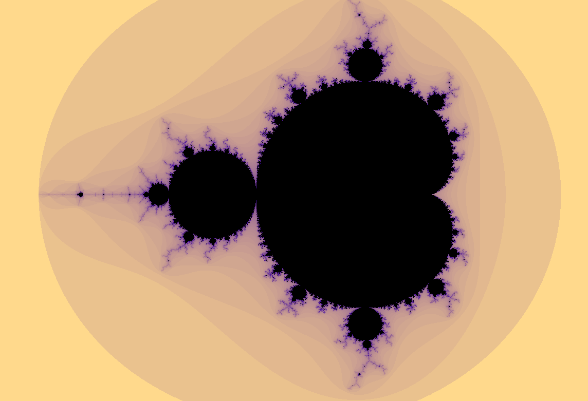
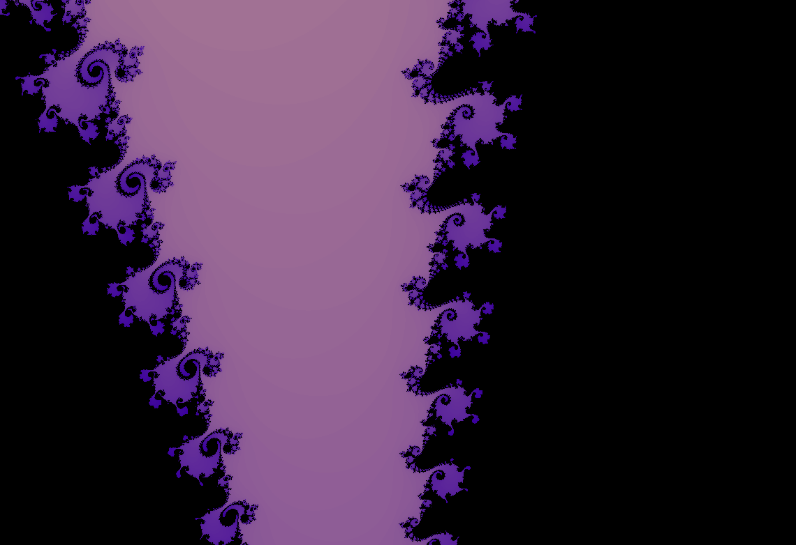

# Mandelbrot-Qml
An example from Qt docs visualizes Mandelbrot set. I added basic pan and scrolling functionality.
This example shows how to create custom materials with shaders.

## Some Screenshots

